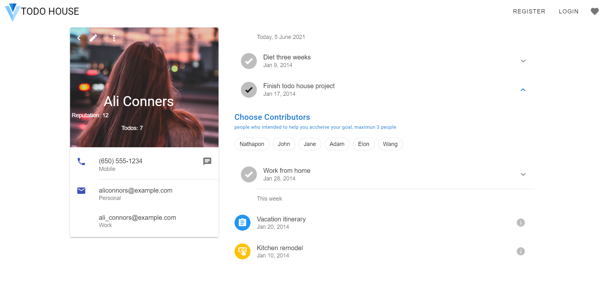

## Todo House

The contribute community to set your **todos** and get your **todos** done on time from people around the world.

## Motivation

I start this project dead simple todo application but COVID-19 quarantine gives me a lot of free time so i come with the idea why not make it a little bit better by making the _Todo House_, a community where people can rest their todos here and let people will notify you when it react due date. they will earn reputation on this wonderful community. :)

## Tech/framework used

<b>Frontend relies heavily on Vue/Vuetify (Material Design)</b>

- [Vue: ^2.6.11](https://electron.atom.io)
- [Vuetify: ^2.4.0](https://electron.atom.io)

<b>Backend</b>

- [express]()
- [bycript]()
- [jsonwebtoken]()
- [mysql2]()
